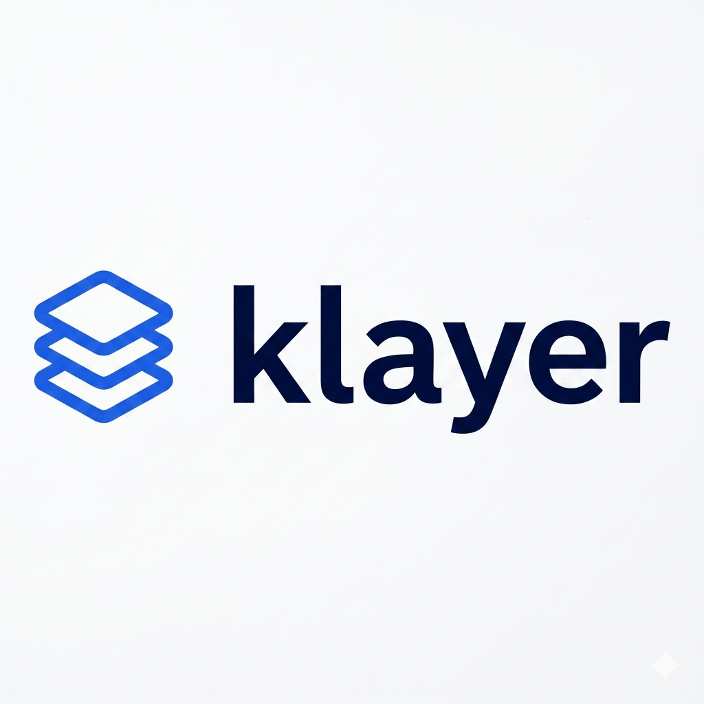

# klayer

<p align="center">
  
</p>

A domain-agnostic, **grounded knowledge layer** for LLMs, shipped as a single
Rust MCP server. One binary gives any MCP-compatible client (Claude Code, Claude
Desktop, Cursor, …) the ability to ingest sources, recall them with provenance,
enforce only validated rules, honor user preferences, and keep an audit trail
for agentic runs — without fat SKILL.md files and without per-server install pain.

## Why it exists

- **Skills bloat.** Large SKILL.md files degrade attention and invite hallucination.
  klayer keeps the skill a _thin router_ and pulls data on demand via `recall`.
- **MCP install friction.** One static binary, one command, one config block.
- **Trust.** Ingested web text is _untrusted data_, never instructions. Only
  `reviewed`/`user` knowledge is ever enforced. This is the safety spine, in code.

## Architecture

```
kl-core    types + traits (Kind, Trust, SearchBackend, Embedder, RecallHit)
kl-store   SQLite: schema, migrations, FTS5 retrieval, trust lifecycle
kl-ingest  fetch -> readable-text extract -> chunk
kl-search  SearchBackend trait + DuckDuckGo (no API key)
kl-skill   renders the THIN SKILL.md router from registries only
kl-mcp     the `klayer` binary: rmcp server wiring the tool surface
```

Trust lifecycle (the one invariant across every use case):

```
untrusted ──(LLM extracts)──> proposed ──(promote = validation gate)──> reviewed - user (authored)
                                                              
only reviewed + user are ENFORCED.
```

## Tools

`recall` · `search_web` · `ingest` · `remember` · `propose` · `promote` ·
`forget` · `list_knowledge` · `set_preference` · `list_domains` ·
`register_domain` · `log_episode` · `compile_skill`

## Quick start (pre-built binary)

A compiled Windows binary is included in the repo at `target/release/klayer.exe`.
No Rust toolchain or model downloads required — just download and run.

**Steps:**

1. Download `target/release/klayer.exe` from this repository.
2. Wire it into your MCP client config (see below).
3. Point `KLAYER_DB` at a writable path for the SQLite database.

```json
{
  "mcpServers": {
    "klayer": {
      "command": "C:\\path\\to\\klayer.exe",
      "env": { "KLAYER_DB": "C:\\path\\to\\klayer.db" }
    }
  }
}
```

The server speaks MCP over stdio. Env vars: `KLAYER_DB` (default `klayer.db`),
`KLAYER_SKILL` (default `skills/klayer/SKILL.md`), `RUST_LOG` (default `info`).

## Build from source

Only needed if you want to modify klayer or target a different OS.
Requires the Rust toolchain (`rustup`).

```bash
cargo build --release
KLAYER_DB=./klayer.db KLAYER_SKILL=./skills/klayer/SKILL.md ./target/release/klayer
```

## Seed a domain (example: secure-coding)

From the client, in plain language: register the domain, ingest a few sources,
let the model `propose` candidate rules, then `promote` the good ones, then
`compile_skill`. Only promoted rules become enforceable. Nothing scraped is
ever trusted as guidance.

## Vector retrieval (optional, later)

Default build is **keyword-only** (FTS5/BM25) so it compiles with zero extra
native deps. The vector path is the documented extension point:

- `Embedder` trait already exists in `kl-core`.
- Add a `chunks_vec` virtual table via `sqlite-vec`, a local CPU embedder
  (e.g. `fastembed`, bge-small-384), and fuse FTS + vector with RRF in
  `Store::recall`. Gate it behind the `embed-local` feature in `kl-mcp`.

## Notes for first compile

Verified against **rmcp 0.16** with `cargo check` — compiles cleanly as-written.
No patch-version tweaks needed:

- `rmcp::handler::server::wrapper::Parameters` — correct import path.
- `McpError::internal_error(msg, None)` — correct signature.

Everything else is standard `rusqlite`/`reqwest`/`scraper`/`tokio`.
