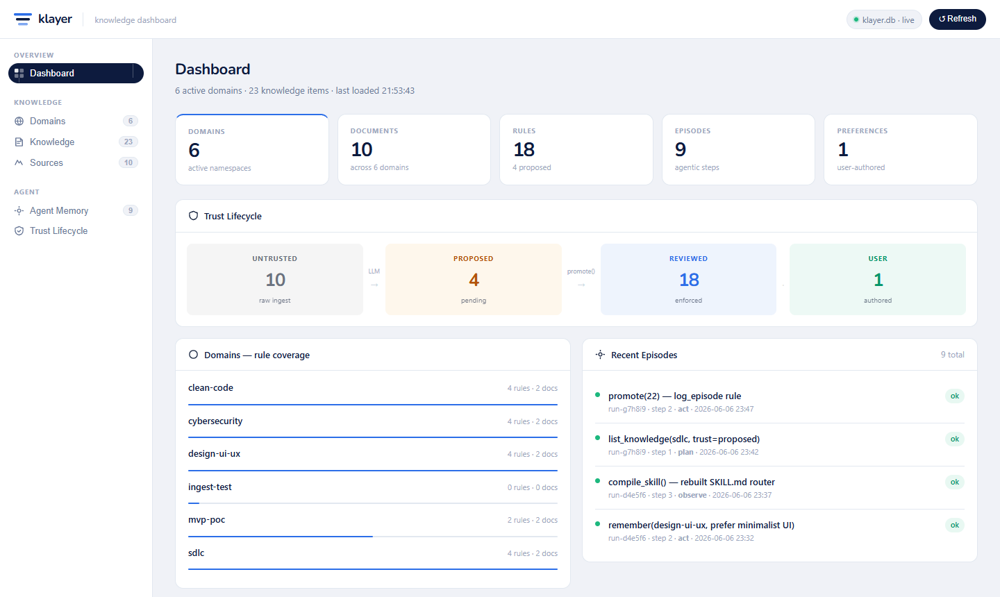
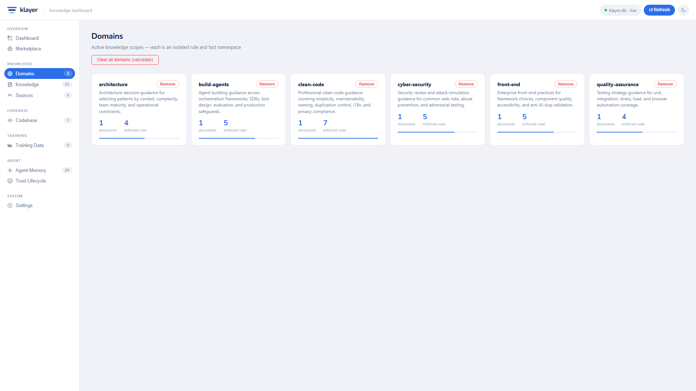
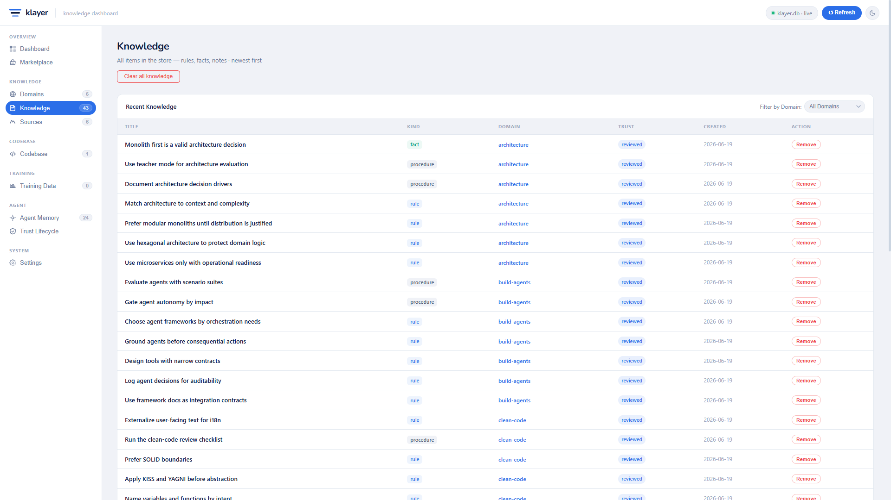
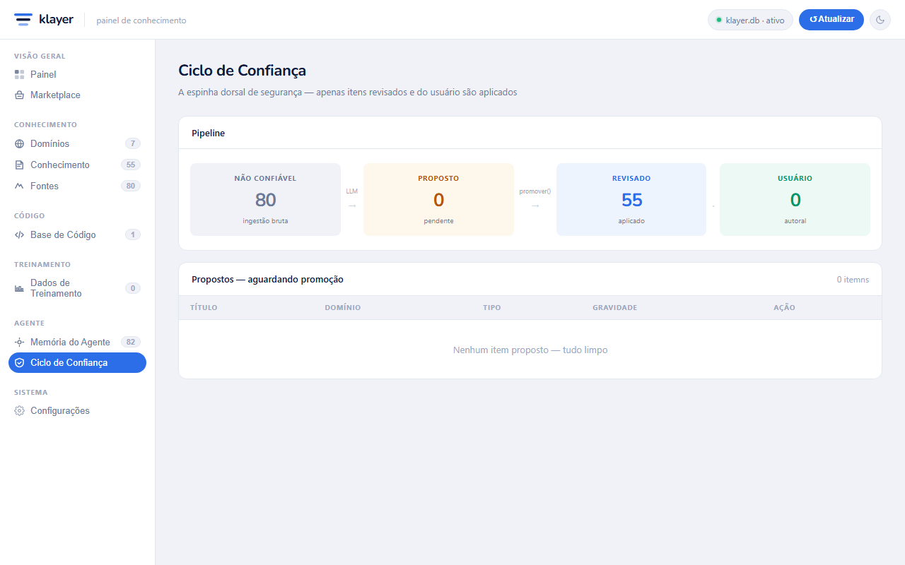
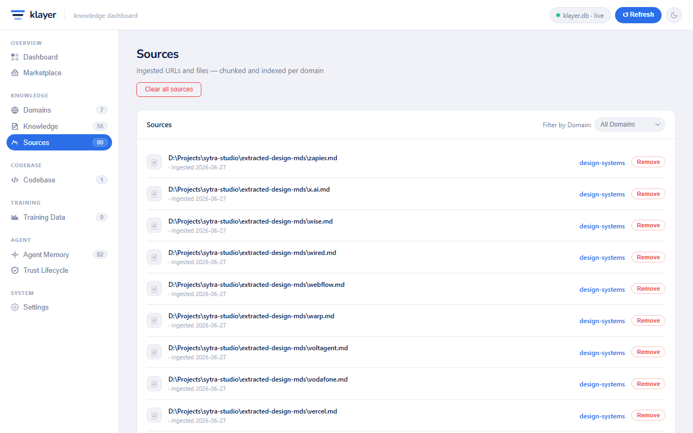
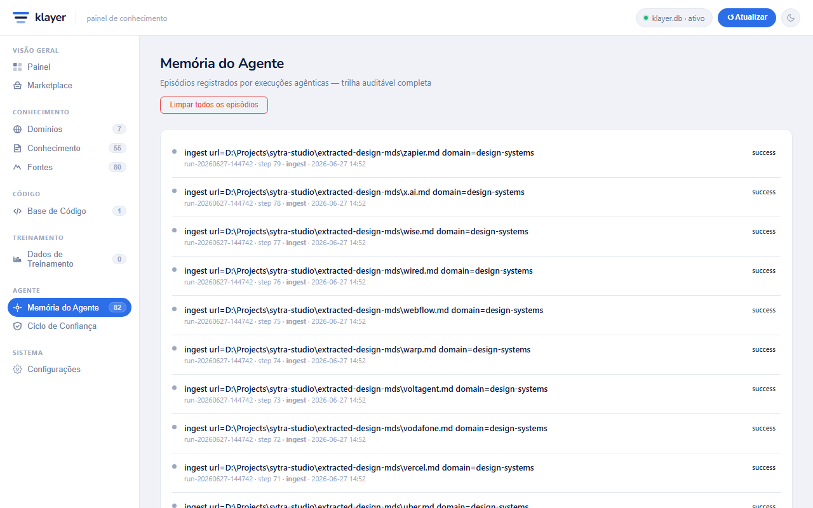
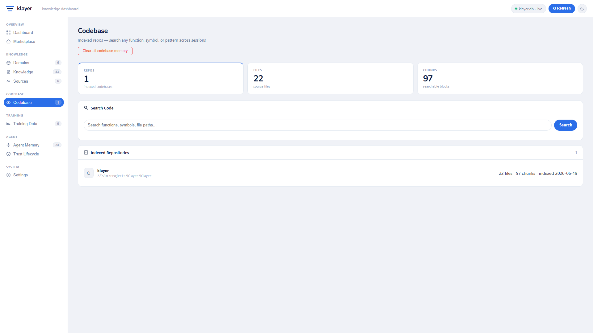
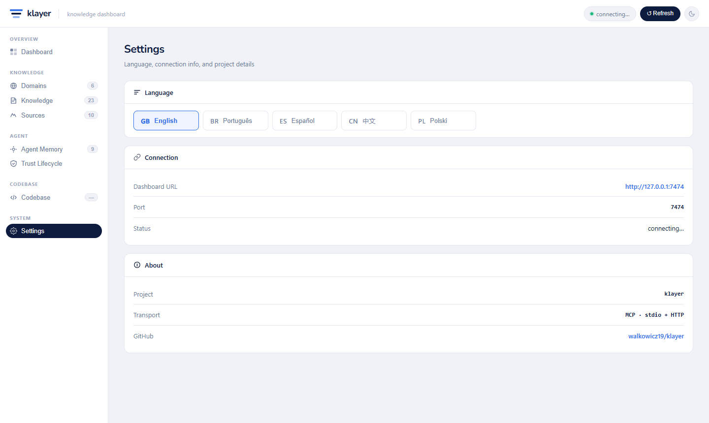

# klayer

<br>

<p align="center">
  
</p>

<br>

A domain-agnostic, **grounded knowledge layer** for LLMs, shipped as a single
Rust MCP server. One binary gives any MCP-compatible client (Claude Code, Claude
Desktop, Cursor, …) the ability to ingest sources, recall them with provenance,
enforce only validated rules, honor user preferences, and keep an audit trail
for agentic runs — without fat SKILL.md files and without per-server install pain.

---

## ⚡ Quick Start: MCP Installation

You can install and use klayer on any machine either by **downloading the pre-built binary** (recommended, no Git clone/Rust toolchain required) or by **building from source**.

> [!IMPORTANT]
> **Do I need to clone this repository?**
> - **No, if you just want to run the MCP server**: You do NOT need to clone the Git repository. You only need the single executable file (`klayer.exe`).
> - **Yes, if you want to modify or compile the code**: Clone this repository and follow the [Build from source](#build-from-source) section.

### Option A: Use the Pre-built Binary (Recommended)

1. **Download the executable**: Go to the repository's **Releases** page on GitHub and download the appropriate binary for your OS:
   - **Windows**: `klayer-windows-x86_64.exe`
   - **Linux**: `klayer-linux-x86_64`
   - **macOS (Intel)**: `klayer-macos-x86_64`
   - **macOS (Apple Silicon M1/M2/M3)**: `klayer-macos-arm64`

> [!NOTE]
> You cannot easily download raw binaries directly from the Git source tree without cloning, so always download them from the **Releases** page.

2. **Create a dedicated folder & prepare the binary**:
   - Create a permanent folder for klayer (e.g. `C:\Users\you\klayer\` on Windows, or `~/klayer/` on Linux/macOS). Put the downloaded binary in it.
   - **Linux/macOS only**: Make the binary executable by running:
     ```bash
     chmod +x ~/klayer/klayer-macos-arm64 # (or matching filename)
     ```

> [!TIP]
> **Keep klayer in a single, permanent folder.**
> Because the MCP server config is global across all workspaces, keeping the binary and both database files (`klayer.db` and `klayer_code.db`) in one permanent place ensures all workspaces share the same memory and the dashboard is always accessible.

3. **Configure automatically (Recommended for users & LLMs)**:
   You can let `klayer` configure itself automatically! Open your terminal, navigate to your klayer folder, and run:
   ```bash
   # Automatically merge klayer config into Claude Desktop:
   ./klayer-windows-x86_64.exe --install

   # Or print the pre-configured JSON block for copy/pasting:
   ./klayer-windows-x86_64.exe --print-mcp-config
   ```
   *(On macOS/Linux, replace `./klayer-windows-x86_64.exe` with your downloaded binary name, e.g., `./klayer-macos-arm64`).*

4. **Configure manually (Alternative)**: Add the server block manually to your MCP client config (e.g., `claude_desktop_config.json` or Cursor settings) for your operating system:

#### 🖥️ Windows Configuration
```json
{
  "mcpServers": {
    "klayer": {
      "command": "C:\\Users\\you\\klayer\\klayer-windows-x86_64.exe",
      "env": {
        "KLAYER_DB": "C:\\Users\\you\\klayer\\klayer.db",
        "KLAYER_CODE_DB": "C:\\Users\\you\\klayer\\klayer_code.db",
        "KLAYER_SKILL": "C:\\Users\\you\\klayer\\skills\\klayer\\SKILL.md"
      }
    }
  }
}
```

#### 🍎 macOS Configuration
```json
{
  "mcpServers": {
    "klayer": {
      "command": "/Users/you/klayer/klayer-macos-arm64",
      "env": {
        "KLAYER_DB": "/Users/you/klayer/klayer.db",
        "KLAYER_CODE_DB": "/Users/you/klayer/klayer_code.db",
        "KLAYER_SKILL": "/Users/you/klayer/skills/klayer/SKILL.md"
      }
    }
  }
}
```

#### 🐧 Linux Configuration
```json
{
  "mcpServers": {
    "klayer": {
      "command": "/home/you/klayer/klayer-linux-x86_64",
      "env": {
        "KLAYER_DB": "/home/you/klayer/klayer.db",
        "KLAYER_CODE_DB": "/home/you/klayer/klayer_code.db",
        "KLAYER_SKILL": "/home/you/klayer/skills/klayer/SKILL.md"
      }
    }
  }
}
```

> [!TIP]
> Setting `KLAYER_SKILL` explicitly ensures that the `compile_skill` tool writes directly to your workspace's skill file regardless of which working directory the MCP client uses when it spawns the server.

4. **Start your client**: When you launch your IDE or Claude client, klayer will start automatically.

> [!NOTE]
> The Live Web Dashboard (`http://localhost:7474`) runs inside the MCP server process. The dashboard will stop working when you close the IDE/MCP client — this is completely normal.

### Option B: Build from Source
If you are on other CPU architectures or want to build/modify klayer yourself, follow the instructions in the [Build from source](#build-from-source) section.

---

## Dashboard

The binary automatically starts a live web dashboard on **http://localhost:7474**
(logged to stderr on startup — click the link or paste it in your browser).
All pages fetch real-time data from the store via a built-in REST API.

The dashboard is fully localised — switch language in the **Settings** page (accessed via the System section in the sidebar) between **English**, **Portuguese (PT)**, **Spanish (ES)**, **Mandarin (ZH)**, and **Polish (PL)**. You can also toggle between light and dark themes using the mode switcher button in the top-right corner of the topbar. All selections are saved in `localStorage`.



### Domains

Each registered domain is an isolated namespace for rules, facts, and ingested sources.



### Knowledge

All items in the store — rules, facts, and procedures — sorted newest first.
Trust tier is colour-coded: `proposed` (amber) · `reviewed` (blue) · `user` (green).
Only **reviewed** and **user** items are ever enforced.



### Trust Lifecycle

The safety spine visualised. Raw ingest stays untrusted; the LLM extracts
candidates into `proposed`; a human calls `promote()` to make them `reviewed`
(enforced). The Proposed table lists every item awaiting that gate, with
severity badges and a Promote button.



### Sources & Agent Memory

**Sources** lists every ingested URL or file with its domain and fetch date.
**Agent Memory** shows the full episode trail logged by agentic runs.

| Sources | Agent Memory |
|---------|--------------|
|  |  |

### Codebase & Settings

**Codebase** shows indexed repository stats and lets you search across all indexed code with full-text search.
**Settings** lets you switch the UI language, view connection info, and see project details.

| Codebase | Settings |
|----------|----------|
|  |  |

### Dashboard port & REST API

The default port is **7474** (`KLAYER_DASHBOARD_PORT` to override).

| Endpoint | Params | Returns |
|----------|--------|---------|
| `GET /` | — | Dashboard SPA |
| `GET /api/stats` | — | Aggregate counts (domains, rules, episodes…) |
| `GET /api/domains` | — | All registered domains with doc/rule counts |
| `GET /api/knowledge` | `domain`, `trust`, `kind` | Knowledge items |
| `GET /api/sources` | `domain` | Ingested sources |
| `GET /api/episodes` | `run_id` | Agentic run audit trail |
| `GET /api/preferences` | — | User preferences |

---

## Why it exists

- **Skills bloat.** Large SKILL.md files degrade attention and invite hallucination.
  klayer keeps the skill a _thin router_ and pulls data on demand via `recall`.
- **MCP install friction.** One static binary, one command, one config block.
- **Trust.** Ingested content is _untrusted data_, never instructions. Only
  `reviewed`/`user` knowledge is ever enforced. This is the safety spine.
- **Shared Memory across Agents.** Since the MCP server configuration is global, all MCP-compatible clients (Claude Code, Cursor, Claude Desktop, etc.) share the exact same database. This allows different agents to seamlessly collaborate, align on the same rules, and log to a single unified audit trail—creating a shared memory layer for your local agentic workflows.

## Architecture

```
kl-core    types + traits (Kind, Trust, SearchBackend, Embedder, RecallHit)
kl-store   SQLite: schema, migrations, FTS5 retrieval, trust lifecycle
kl-ingest  fetch (HTTP or local file) -> content-type dispatch -> chunk
kl-search  SearchBackend trait + DuckDuckGo / Bing / Brave with auto-fallback
kl-skill   renders the THIN SKILL.md router from registries only
kl-mcp     the `klayer` binary: rmcp MCP server + axum dashboard HTTP server
```

Trust lifecycle (the one invariant across every use case):

```
untrusted ──(LLM extracts)──> proposed ──(promote = validation gate)──> reviewed - user (authored)
only reviewed + user are ENFORCED.
```

## Tools

| Tool | Description |
|---|---|
| `recall` | Retrieve grounded knowledge for a domain (FTS5 + curated rules) |
| `search_web` | Web search via configured engine; results are DATA only |
| `ingest` | Fetch a URL or local file and chunk it into the reference tier |
| `remember` | Store a user-authored fact (`trust=user`, enforced immediately) |
| `propose` | Submit a candidate rule/fact (`trust=proposed`, not enforced) |
| `promote` | Validate a proposed item → `trust=reviewed` (now enforceable) |
| `forget` | Delete a knowledge item by id |
| `list_knowledge` | List facts/rules/procedures in a domain with trust and ids |
| `list_sources` | List every ingested file or URL with provenance and fetch time |
| `list_episodes` | Query the agentic run audit trail |
| `list_domains` | Show all registered domains with doc and rule counts |
| `set_preference` | Store a durable user preference (always honored) |
| `register_domain` | Create or update a domain with description and query hint |
| `clear_domain` | Fully delete a domain and all its data; `chunks_only=true` keeps promoted rules |
| `log_episode` | Record one step of an agentic run for auditability |
| `compile_skill` | Regenerate the SKILL.md router from the current registries |
| `index_codebase` | Walk a directory and index all source files into the codebase DB for semantic search |
| `search_code` | Full-text + semantic search across all indexed codebases; returns matching snippets with file paths |
| `list_repos` | List all indexed repositories with file/chunk counts and last-indexed timestamps |
| `forget_repo` | Remove a previously indexed repository (all files and chunks) from the codebase DB |
| `clear_codebase` | Wipe ALL indexed codebase memory — every repository, file, and chunk |
| `clear_domains` | Wipe ALL domains and ALL cascading data — knowledge, sources, chunks, and registrations. Codebase memory is unaffected |
| `clear_knowledge` | Wipe ALL knowledge items across every domain (domains and sources kept) |
| `clear_sources` | Wipe ALL ingested sources and chunks across every domain (knowledge kept) |
| `clear_episodes` | Wipe ALL agentic run episodes from the audit trail |

## Environment variables

| Variable | Default | Description |
|---|---|---|
| `KLAYER_DB` | `klayer.db` | Path to the knowledge SQLite database |
| `KLAYER_CODE_DB` | `klayer_code.db` | Path to the codebase memory SQLite database |
| `KLAYER_SKILL` | `skills/klayer/SKILL.md` | Path where `compile_skill` writes the router |
| `KLAYER_DASHBOARD_PORT` | `7474` | Port for the live dashboard HTTP server |
| `KLAYER_SEARCH` | `auto` | Search engine: `auto` · `duckduckgo` · `bing` · `brave` |
| `KLAYER_BRAVE_API_KEY` | — | Required when `KLAYER_SEARCH=brave` |
| `RUST_LOG` | `info` | Log level (logs go to stderr, not the MCP channel) |

### Search engine options

| Value | Behaviour |
|---|---|
| `auto` _(default)_ | DuckDuckGo first; falls back to Bing automatically on empty results |
| `duckduckgo` | DuckDuckGo HTML scraping only |
| `bing` | Bing HTML scraping only |
| `brave` | Brave Search REST API — most reliable; free tier 2 000 req/month at [brave.com/search/api](https://brave.com/search/api/) |

## Ingest sources

`ingest` accepts HTTP/HTTPS URLs, absolute local file paths, and `file://` URIs.
Content-type is detected automatically:

| Type | Detected by |
|---|---|
| HTML | `text/html` response header or `.html`/`.htm` extension |
| PDF | `application/pdf` or `.pdf` extension |
| JSON | `application/json` or `.json` extension |
| Markdown | `text/markdown` or `.md`/`.markdown` extension |
| Plain text | `text/plain` or `.txt`/`.csv` extension |

```
# Web URL
ingest("https://example.com/policy.html", "company-policies")

# Local PDF — no server needed
ingest("C:\\policies\\hr.pdf", "company-policies")

# JSON API response
ingest("https://api.example.com/rules.json", "secure-coding")
```

## Typical workflow

```
1. register_domain("my-domain", description, query_hint)
2. ingest(url_or_path, "my-domain")          # repeat for each source
3. recall("my-domain", "your question")      # model grounds its answer
4. propose("my-domain", "rule", title, body) # model extracts a candidate rule
5. promote(id)                               # you validate it → now enforced
6. compile_skill()                           # regenerate SKILL.md router
```

## Memory management

```
list_knowledge("my-domain")                  # see all curated items + ids
list_sources("my-domain")                    # see all ingested files/URLs
forget(id)                                   # delete one item
clear_domain("my-domain")                    # wipe everything including the domain
clear_domain("my-domain", chunks_only=true)  # keep rules, clear ingested docs only
```

## Build from source

Only needed to modify klayer or target a different OS. Requires `rustup`.

```bash
cargo build --release
KLAYER_DB=./klayer.db ./target/release/klayer
# Dashboard opens automatically at http://localhost:7474
```

## Vector retrieval (optional, later)

Default build is **keyword-only** (FTS5/BM25) — zero extra native dependencies.
The vector extension point:

- `Embedder` trait in `kl-core`.
- Add `chunks_vec` virtual table via `sqlite-vec` + a local CPU embedder (e.g. `fastembed`, bge-small-384), fuse FTS + vector with RRF in `Store::recall`.
- Gate behind the `embed-local` feature flag in `kl-mcp`.

## 📜 License & Modification Note

This project is licensed under the [MIT License](LICENSE).

> [!NOTE]
> **Attribution Requirement**
> Anyone is free to use, modify, adapt, or distribute this project and its source code. The only condition is that you **must give credit** to the original repository ([walkowicz19/klayer](https://github.com/walkowicz19/klayer)) and its original author.

